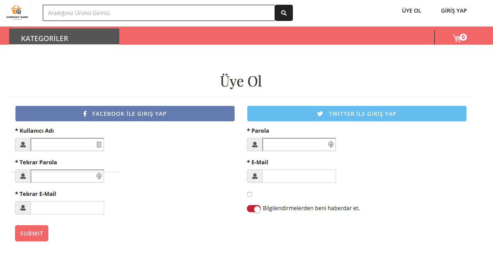
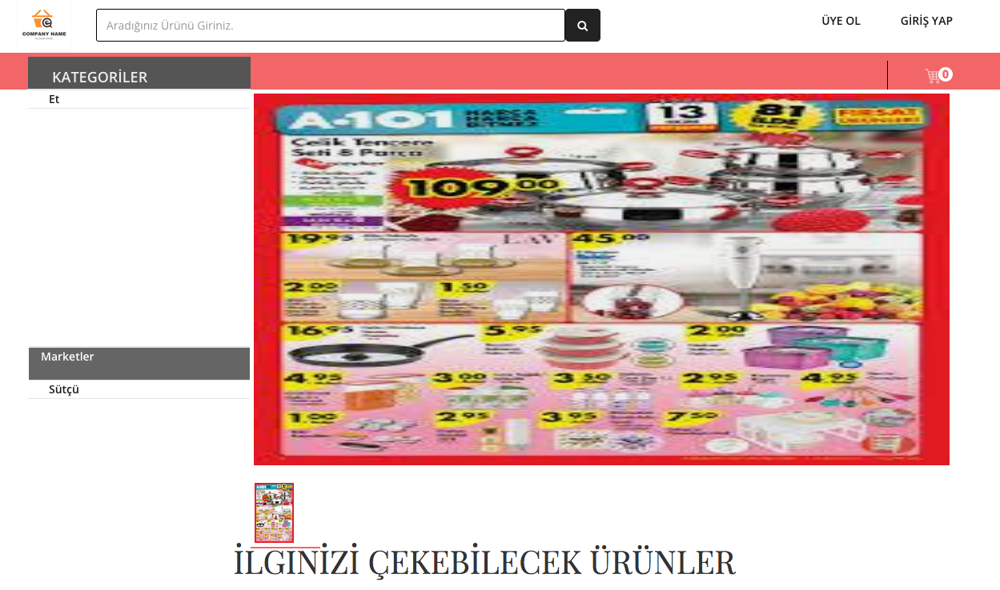
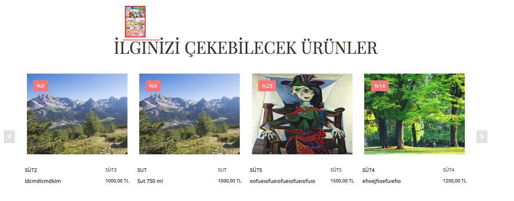
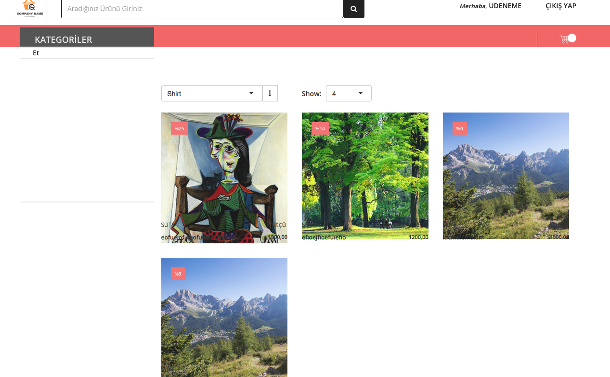
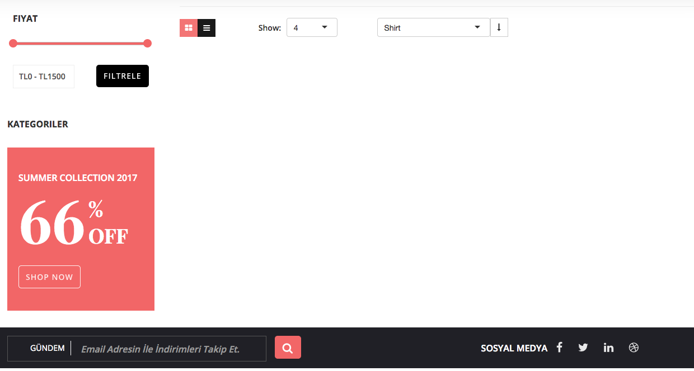

# MarketProject

    
MarketProject is a basic price comparison e-commerce site.  

#####You don't use at production. Because I have stopped development.   

<table><tr><td align="center"><a href="https://github.com/umit-ozturk">  <b>Ümit Öztürk</b></a> </td></tr></table>  

## Installation
Clone the repository and create a virtual environment.

    $ git clone https://github.com/umit-ozturk/marketProject.git
	$ cd MovieDeep
	$ virtualenv -p python3 env
	$ source env/bin/activate
    $ pip install -r requirements.txt

## Create superuser

    $ python manage.py createsuperuser
    
## Run Server
    
    $ python manage.py runserver

## Docs

Coming Soon.

## Screenshots

